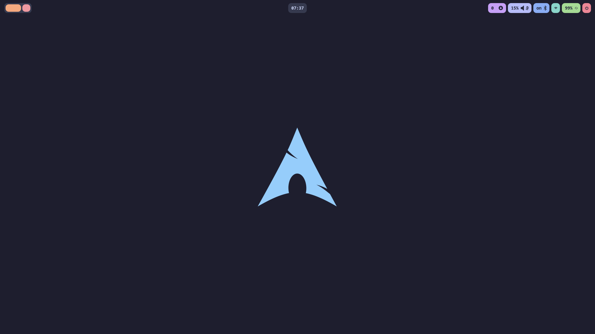
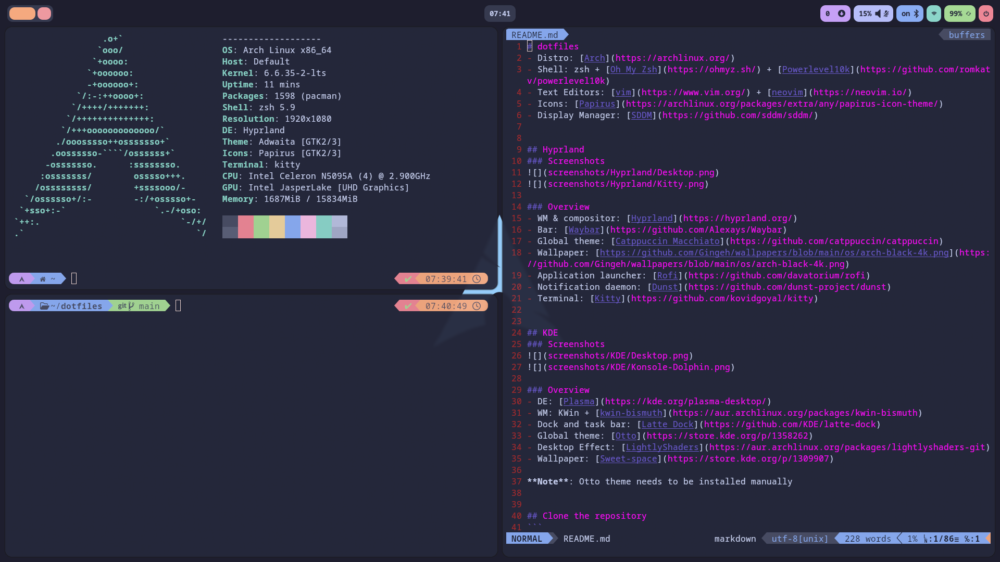
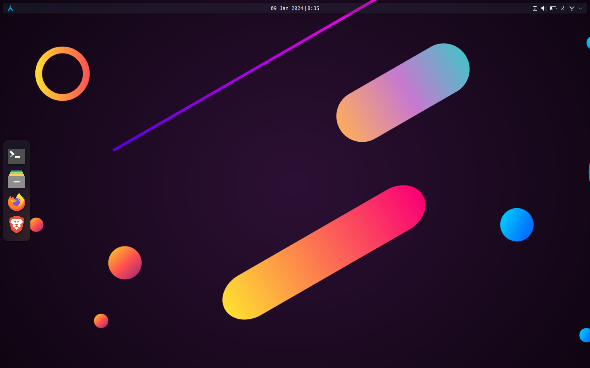
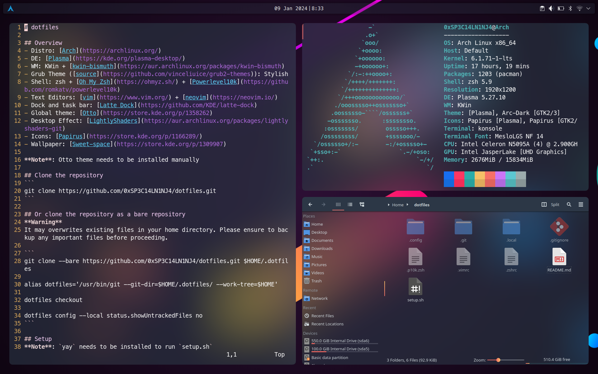

# dotfiles
- Distro: [Arch](https://archlinux.org/)
- Shell: zsh + [Oh My Zsh](https://ohmyz.sh/) + [Powerlevel10k](https://github.com/romkatv/powerlevel10k)
- Text Editors: [vim](https://www.vim.org/) + [neovim](https://neovim.io/)
- Icons: [Papirus](https://archlinux.org/packages/extra/any/papirus-icon-theme/)
- Display Manager: [SDDM](https://github.com/sddm/sddm/)


## Hyprland
### Screenshots



### Overview
- WM & compositor: [Hyprland](https://hyprland.org/)
- Bar: [Waybar](https://github.com/Alexays/Waybar)
- Global theme: [Catppuccin Macchiato](https://github.com/catppuccin/catppuccin)
- Wallpaper: [https://github.com/Gingeh/wallpapers/blob/main/os/arch-black-4k.png](https://github.com/Gingeh/wallpapers/blob/main/os/arch-black-4k.png)
- Application launcher: [Rofi](https://github.com/davatorium/rofi)
- Notification daemon: [Dunst](https://github.com/dunst-project/dunst)
- Terminal: [Kitty](https://github.com/kovidgoyal/kitty)


## KDE
### Screenshots



### Overview
- DE: [Plasma](https://kde.org/plasma-desktop/)
- WM: KWin + [kwin-bismuth](https://aur.archlinux.org/packages/kwin-bismuth)
- Dock and task bar: [Latte Dock](https://github.com/KDE/latte-dock)
- Global theme: [Otto](https://store.kde.org/p/1358262)
- Desktop Effect: [LightlyShaders](https://aur.archlinux.org/packages/lightlyshaders-git)
- Wallpaper: [Sweet-space](https://store.kde.org/p/1309907)

**Note**: Otto theme needs to be installed manually


## Clone the repository
```
git clone https://github.com/0xSP3C14LN1NJ4/dotfiles.git
```

## Or clone the repository as a bare repository
**Warning**
It may overwrites existing files in your home directory. Please ensure to backup any important files before proceeding.

```
git clone --bare https://github.com/0xSP3C14LN1NJ4/dotfiles.git $HOME/.dotfiles

alias dotfiles='/usr/bin/git --git-dir=$HOME/.dotfiles/ --work-tree=$HOME'

dotfiles checkout

dotfiles config --local status.showUntrackedFiles no
```

## Setup
**Note**: `yay` needs to be installed to run `setup.sh`
```
chmod +x setup.sh

./setup.sh
```

## Replace the new .zshrc created by oh-my-zsh install by the old one and change shell
**Reboot after changing shell**
```
rm .zshrc

mv .zshrc.pre-oh-my-zsh .zshrc

source $HOME/.zshrc

chsh -s /usr/bin/zsh
```

## Install plugins for neovim
```
# Enter in neovim
nvim

# Run the following command in neovim
:PlugInstall
```
