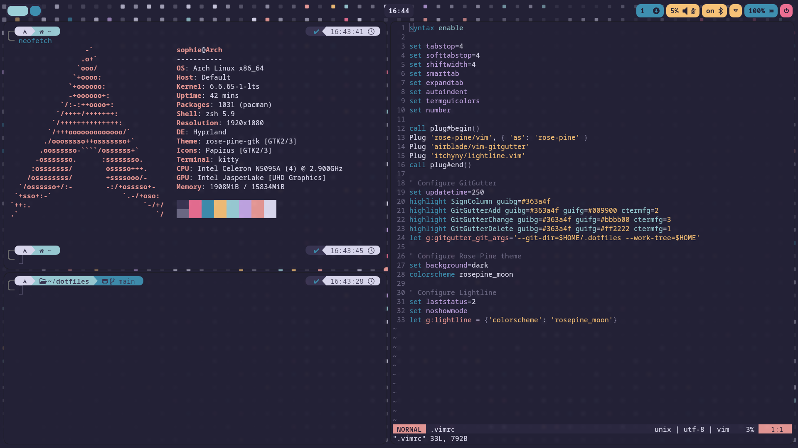

# dotfiles
- Distro: [Arch](https://archlinux.org/)
- Shell: zsh + [Oh My Zsh](https://ohmyz.sh/) + [Powerlevel10k](https://github.com/romkatv/powerlevel10k)
- Text Editors: [vim](https://www.vim.org/) + [neovim](https://neovim.io/)
- Icons: [Papirus](https://archlinux.org/packages/extra/any/papirus-icon-theme/)
- Display Manager: [SDDM](https://github.com/sddm/sddm/)
- WM & compositor: [Hyprland](https://hyprland.org/)
- Bar: [Waybar](https://github.com/Alexays/Waybar)
- Global theme: [Rosé Pine](https://rosepinetheme.com/)
- Wallpaper: [https://github.com/rose-pine/wallpapers/blob/main/blockwavemoon.png](https://github.com/rose-pine/wallpapers/blob/main/blockwavemoon.png)
- Application launcher: [Rofi](https://github.com/lbonn/rofi)
- Power menu: [Rofi Power Menu](https://github.com/jluttine/rofi-power-menu)
- Notification daemon: [Dunst](https://github.com/dunst-project/dunst)
- Terminal: [Kitty](https://github.com/kovidgoyal/kitty)





## Clone the repository
```
git clone https://github.com/sophie-72/dotfiles.git
```

## Or clone the repository as a bare repository
**Warning**
It may overwrites existing files in your home directory. Please ensure to backup any important files before proceeding.

```
git clone --bare https://github.com/sophie-72/dotfiles.git $HOME/.dotfiles

alias dotfiles='/usr/bin/git --git-dir=$HOME/.dotfiles/ --work-tree=$HOME'

dotfiles checkout

dotfiles config --local status.showUntrackedFiles no
```

## Setup
**Note**: `yay` needs to be installed to run `setup.sh`
```
chmod +x setup.sh

./setup.sh
```

## Replace the new .zshrc created by oh-my-zsh install by the old one and change shell
**Reboot after changing shell**
```
rm .zshrc

mv .zshrc.pre-oh-my-zsh .zshrc

source $HOME/.zshrc

chsh -s /usr/bin/zsh
```

## Install plugins for neovim
```
# Enter in neovim
nvim

# Run the following command in neovim
:PlugInstall
```
